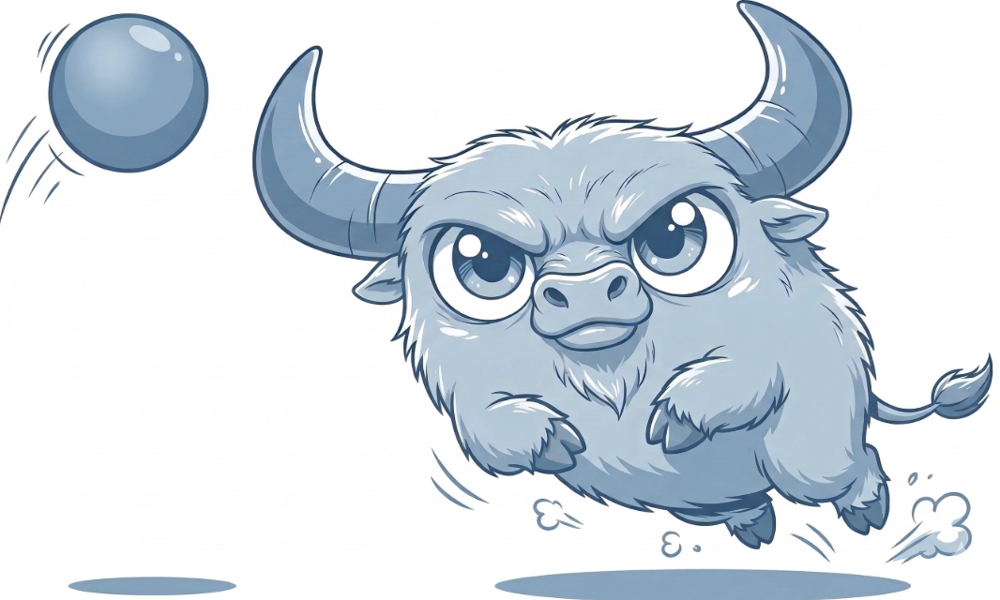
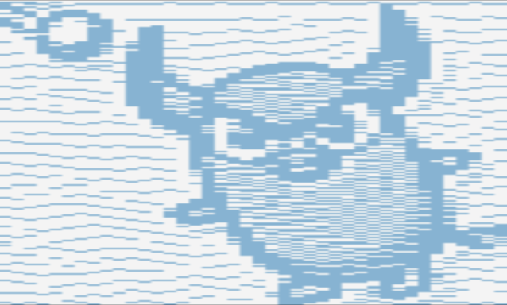
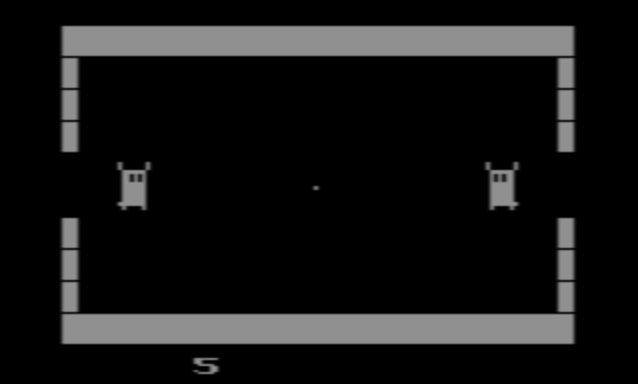
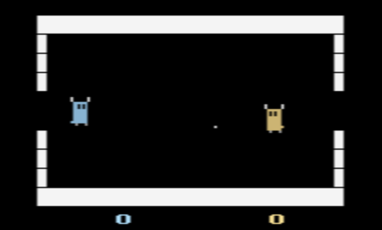
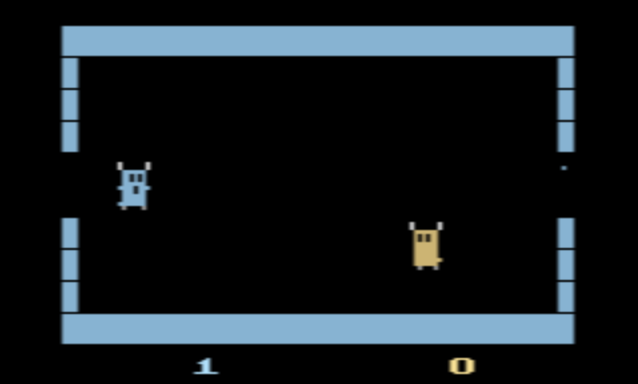
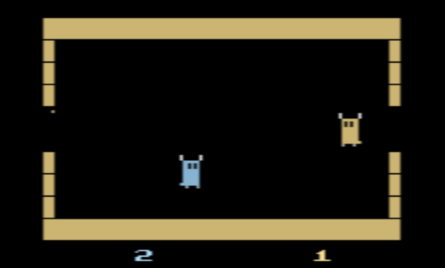

# Bounstryk

**Bounstryk** is a homebrew video game developed for the Atari 2600 Video
Computer System (VCS). It takes classic bouncing ball mechanics and injects the
chaotic energy of Air-Hockey, resulting in a fast-paced "contact sport" where
physics and positioning are key.

## ✨ Features

* **Hybrid Gameplay:** Combines the bouncing ball mechanics with the physical
    collisions of Hockey.
* **The Character:** Play as the beloved mascot: Bounstryker.
* **Versatile Modes:**
    * **Human vs Human:** Challenge a friend in local multiplayer.
    * **Human vs Computer:** Face off against an opponent controlled by the
        CPU.
    * **Computer vs Computer:** Watch matches between two opponents controlled
        by the CPU.
* **Scoring System:** Select the target goals to score for a player to win a
    match, and the size of the field's goals.
* **NTSC Support:** Currently the game only has support for NTSC.

## 🎮 How to Play

### Get and load the ROM

Download the latest ROM (`.bin` file) from the [releases](releases/).

Play the game by loading the ROM in either:
* An **Atari 2600 emulator**. For example [Stella](https://stella-emu.github.io/)
    or [Javatari](https://javatari.org/). You just need to load the ROM file in
    the emulator's software.
* An original **Atari 2600 console**. The ROM content would need to be written
    into a catridge. However, another alternative is using the
    [Harmony Cartridge](https://harmony.atariage.com/Site/Harmony.html).

### The Objective

Two players face off on the digital pitch. The objective is simple: hit the
ball past your opponent to score a goal. The first player that scores enough
goals to reach the defined target score wins the match.

### Controls

| Control | Function |
| :--- | :--- |
| Joystick 1 Up | Player 1 Up (if Player 1 is not controlled by the CPU) |
| Joystick 1 Down | Player 1 Down (if Player 1 is not controlled by the CPU) |
| Joystick 1 Left | Player 1 Left (if Player 1 is not controlled by the CPU) |
| Joystick 1 Right | Player 1 Right (if Player 1 is not controlled by the CPU) |
| Joystick 1 Button | Player 1 Hits (if Player 1 is not controlled by the CPU) Start Match (if the game is in mode selection) |
| Joystick 2 Up | Player 2 Up (if Player 2 is not controlled by the CPU) |
| Joystick 2 Down | Player 2 Down (if Player 2 is not controlled by the CPU) |
| Joystick 2 Left | Player 2 Left (if Player 2 is not controlled by the CPU) |
| Joystick 2 Right | Player 2 Right (if Player 2 is not controlled by the CPU) |
| Joystick 2 Button | Player 2 Hits (if Player 2 is not controlled by the CPU) Start Match (if the game is in mode selection) |
| Select Game | Mode Selection (selecting the target score and the size of the field's goals) |
| Reset Game | Start or Re-start the match in the current mode |
| Color TV | Resume Match (if the match is paused) |
| Black/White TV | Pause Match (if the match is in progress) |
| Left Player Difficulty A | CPU controls Player 1 |
| Left Player Difficulty B | A human controls Player 1 by using Joystick 1 |
| Right Player Difficulty A | CPU controls Player 2 |
| Right Player Difficulty B | A human controls Player 2 by using Joystick 2 |

## 📺 Screenshots

## 🛠️ Building form Source

Get the source code from the [source directory](src/).

If you want to modify the code or build the ROM yourself, these are some
alternative tools that you can use:
* [Atari Dev Studio](https://marketplace.visualstudio.com/items?itemName=chunkypixel.atari-dev-studio),
    which is an extension for [VS Code](https://code.visualstudio.com/).
* [8bitworkshop IDE](https://8bitworkshop.com/), which can be used from a
    browser (since is Web available).
* The compiler tools of [Batari Basic](https://github.com/batari-Basic/batari-Basic),
    which can be used through the CLI.

## 📜 License

This project is open source and available under the [Apache 2 license](LICENSE).

The images in this project are licensed under the Creative Commons Attribution
4.0 International (CC-BY 4.0) License. For the full terms of the license,
please see the [LICENSE](imgs/LICENSE) file in the [imgs](imgs/) directory.

Disclaimer: This is a personal project. The views, code, and opinions expressed
here are my own and do not represent those of my current or past employers.
